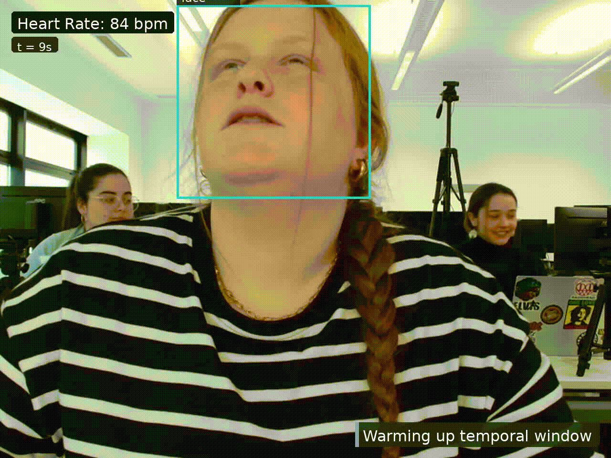

# Fairness-Aware Multimodal Transformer Modeling for Real-Time Student Attention Estimation

This repository contains the implementation of my Master's thesis, completed as part of the [MSc Information Studies](https://www.uva.nl/en/programmes/masters/information-studies/information-studies.html) programme at the [University of Amsterdam](https://www.uva.nl/en).

## Thesis

- **Author:** Christoforos Fragkiadakis
- **Programme:** MSc Information Studies, Data Science Track
- **University:** University of Amsterdam
- **Supervisor:** [Dr. S.S. (Sahand) Mohammadi Ziabari](https://www.uva.nl/en/profile/m/o/s.s.mohammadi-ziabari/s.s.mohammadi-ziabari.html)
- **Thesis:** [`Thesis.pdf`](Thesis.pdf)


<br>

<p align="center">
  
</p>

<p align="center">
  <em>Real-time student attention estimation on <a href="https://www.scidb.cn/en/detail?dataSetId=7856c716c0cc4589a23ee4a23d8a0893#p2">DIPSER dataset</a> using the fairness-aware multimodal transformer.</em>
</p>

<br>

## Abstract
Student attention is a key factor in learning and academic performance, yet existing engagement models are evaluated primarily using aggregate predictive metrics and often overlook demographic disparities. This thesis investigates whether fairness-aware multimodal transformer models can reduce demographic disparities in student attention estimation while maintaining predictive performance. Experiments were conducted on the DIPSER dataset which combines facial images, wearable sensor measurements, attention annotations, and demographic metadata collected in natural classroom settings. Three baseline architectures were evaluated: a visual GRU, a sensor GRU, and a Residual Fusion Transformer that integrates both modalities. Fairness-aware training was subsequently applied to the architecture with the lowest mean validation error, using demographic disparity regularization to target gender and age-based error disparities. The results show that multimodal fusion achieved the best average predictive performance and the lowest worst-group error among the baseline models, while visual information remained the dominant modality. Fairness regularization reduced disparities during validation but did not consistently generalize to unseen subjects. These findings highlight the challenges of achieving stable fairness improvements in multimodal educational AI systems.


## Data

Download [DIPSER dataset](https://www.scidb.cn/en/detail?dataSetId=7856c716c0cc4589a23ee4a23d8a0893#p2) from the official dataset page.

The dataset is larger than 660 GB and contains 9 experiments collected across 3 groups. Each subject folder includes image frames, smartwatch sensor recordings, attention/emotion labels, and demographic metadata. Because these modalities are stored separately, preprocessing is a multi-stage process: visual frames, sensor readings, labels, and metadata must be aligned into one parquet dataset before the experiment notebooks can be run.

The raw DIPSER data were extracted to follow the format:

```text
Data/DIPSER/
  group01/
    experiment01/
      subject_01/
        images/
        labels/          # attention and emotion annotations
        metadata.tar     # frame metadata, demographics, face attributes
        watch_sensors/   # smartwatch sensor JSON files
```

## Installation

Create and activate a Python environment, then install dependencies:

```bash
pip install -r requirements.txt
```

The CLIP feature extraction step requires the OpenAI CLIP package listed in `requirements.txt`.

## Preprocessing

The preprocessing pipeline creates the final tabular dataset used by the experiments:

```text
Data/dipser_dataset.parquet
```

Run the full preprocessing pipeline from the project root:

```bash
python -m src.preprocessing.preprocessing_pipeline \
  --raw-root Data/DIPSER \
  --output-dir Data \
  --num-workers 4
```

Arguments:

```text
--raw-root      Path to the extracted raw DIPSER folder. This folder should contain group01, group02, etc.
--output-dir    Directory where preprocessing outputs are written, including intermediate files and dipser_dataset.parquet.
--num-workers   Number of subject files processed in parallel during sensor aggregation. Use a value that matches your available CPU resources.
--skip-existing  Reuse already created subject CSV files and aggregated subject parquet files. Useful when preprocessing was interrupted.
```

For a detailed explanation of the preprocessing pipeline and its intermediate files, see
[`src/preprocessing/README.md`](src/preprocessing/README.md).

## Extract CLIP Visual Features

The visual and multimodal models use CLIP ViT-L/14 features extracted from the per-frame images. After creating `Data/dipser_dataset.parquet`, run:

```bash
python -m src.clip_vit_feature_extraction \
  --dataset-path Data/dipser_dataset.parquet \
  --output-dir Data/ALL_clip_vitl14_features
```

This creates the visual feature store and frame index used by the visual and fusion notebooks.

## Baseline and Fairness Models

After preprocessing, the baseline and fairness experiment notebooks can be run. The main required files are:

```text
Data/dipser_dataset.parquet
Data/ALL_clip_vitl14_features/
```

The experiment notebooks include:

```text
Sensor Baseline.ipynb
Visual Baseline.ipynb
Fusion Residual Transformer Baseline .ipynb
Temporal Fusion Subject Age MAE Gap Residual Transformer.ipynb
Temporal Fusion Subject Gender MAE Gap Residual Transformer.ipynb
```


## References

**DIPSER: A Dataset for In-Person Student Engagement Recognition in the Wild**
Luis Marquez-Carpintero, Sergio Suescun-Ferrandiz, Carolina Lorenzo Álvarez, Jorge Fernandez-Herrero, Diego Viejo, Rosabel Roig-Vila, Miguel Cazorla
Computer Vision and Pattern Recognition (cs.CV); Artificial Intelligence (cs.AI)
arXiv: 2502.20209v2 [cs.CV], 2 Mar 2025
